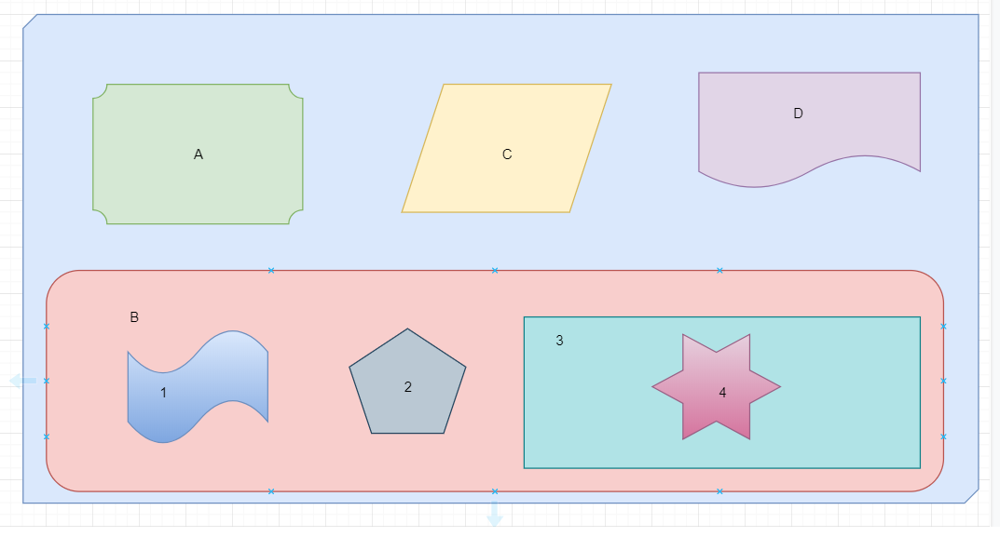

Any Angular application is a tree of components. So when designing components, you need to ensure that they’re reusable and self-contained and at the same time 
have some means of communicating with each other.

That is the goal of this article to explain how components can pass data to each other in a loosely coupled manner.

Let's dig in,
  - **Parent to Child using the Input Decorator**
  - **Child to Parent via ViewChild**
  - **Child to Parent via Output and EventEmitter **
  - **Reactive Apporach to Share Data Between Any Components Using Services**
  - **Final Thoughts**

The picture below depicts a typical UI composition where each shape represents a component. I have purposely avoided using HTML elements such as input fields, buttons for easier reference.



When you design a view that consists of multiple components, the less they know about each other, the better.

Say a user clicks the button in component 4, which has to initiate some actions in component 5. Is it possible to implement this scenario without component 4 knowing that component 5 exists? Yes, it is. 


### Parent to Child using the Input Decorator

> The input properties of a component are decorated with **@Input** and are used to get data from the parent component.

When you declare a variable with the Input decorator in the child component, it allows that variable to be received from a parent template. 

##### child.component.ts

```typescript
import { NgModule, Component, Input } from '@angular/core';

@Component({
    selector: 'child-processor',
    template: `You have new message : {{infoMessage}}`,
    styleUrls: ['./child.component.css']
})
class ChildComponent {

    @Input() infoMessage: string;
    
    constructor() { }
}
```

In this case, we define a message variable in the parent, then use square brackets to pass the data to the child. Now the child can display this data in its template.

##### parent.component.ts

```typescript

import { Component OnInit } from '@angular/core';

@Component({
    selector: 'parent-processor',
    template: ` <input type="text" placeholder="Enter Message" (change)="onInputEvent($event)"><br/>
                <child-processor [infoMessage]="message"></child-processor>
              `
    styleUrls: ['./parent.component.css'] 
})
class ParentComponent implements OnInit {

    message: string;
    
    constructor() { }
    ngOnInit() { }
    
    onInputEvent({target}) : void {
        this.message = target.value;
    }
}
```

```typescript
import { platformBrowserDynamic } from '@angular/platform-browser-dynamic';
import { BrowserModule } from '@angular/platform-browser';

@NgModule({
    imports: [ BrowserModule],
    declarations: [ ParentComponent, ChildComponent],
    bootstrap: [ ParentComponent ]
})
class AppModule { }
platformBrowserDynamic().bootstrapModule(AppModule);

```

### Child to Parent via Output and EventEmitter

> Angular components can dispatch custom events using the **EventEmitter** object. Those events can be handled either in the component or by its parent components.

This approach is ideal when you want to share data changes that occur on things like button clicks, form entries, and other user events. 

In the child, we declare a **messageEvent** variable with the Output decorator and set it equal to a new event emitter. Then we can create a function named 
**sendMessage** that calls emit on this event with the message we want to send to the child. 

##### child.component.ts

```typescript

import { Component, Output, EventEmitter } from '@angular/core';

@Component({
    selector: 'app-child',
    template: `<button (click) = "sendMessage()" class="button"> Send Message </button>`,
    styleUrls: ['./child.component.css']
})
class ChildComponent {

    message: string = 'Hello from child';
    
    @Output() messageEvent = new EventEmitter<string>(); // EventEmitter is 
    
    constructor() { }
    
    sendMessage() : void {
        this.messageEvent.emit(this.message);
    }
}

```

In the parent, we have created a function to receive the message and set it equal to the message variable which in turn will be displayed on UI. 

The parent can now subscribe to this **messageEvent** that's outputted by the child component, then run the receive message function whenever this event occurs. 

##### parent.component.ts

```typescript
import { Component, OnInit } from '@angular/core';

@Component({
    selector: 'app-parent',
    template: ` <h1> Parent </h1>
                 Message from child : {{message}}
                <app-child (messageEvent)="receiveMessage($event)" ></app-child>
              `
    styleUrls: ['./parent.component.css'] 
})
class ParentComponent implements OnInit {

    message: string;
    
    constructor() { }
    
    ngOnInit() { }
    
    receiveMessage($event) : void {
        this.message = $event;        // So, every time button is clicked in child view, receiveMessage function will be invoked.
    }
}

```

Lastly, we create a button to trigger this function.

### Child to Parent via ViewChild

> **ViewChild** allows one component to be injected into another, giving the parent access to its attributes and functions. 

One caveat, however, is that the child won't be available until after the view has been initialized. This means we need to implement the AfterViewInit lifecycle hook to receive the data from the child.  

##### child.component.ts

```typescript
import { Component } from '@angular/core';

@Component({
    selector: 'app-child',
    template: `<h1> Child </h1>`,
    styleUrls: ['./child.component.css']
})
class ChildComponent {

    childMessage: string = 'Hello from child';
    
    constructor() { }
}

```

In the AfterViewInit function, we can access the message variable defined in the child.

##### parent.component.ts

```typescript
import { Component, AfterViewInit, ViewChild } from '@angular/core';

@Component({
    selector: 'app-parent',
    template: ` <h1> Parent </h1>
                 Message from child : {{message}}
                <app-child></app-child>
              `
    styleUrls: ['./parent.component.css'] 
})
class ParentComponent implements AfterViewInit {

    @ViewChild(ChildComponent) childComp : ChildComponent; // ViewChild returns the first element that matches a given component.
    
    message: string;
    
    constructor() { }
    
    ngAfterViewInit() : void {
        this.message = this.childComp.childMessage; // Here, We can access Child Property directly.
    }
}

```

One important thing to note here is that The @ViewChild decorator cannot see across component boundaries!

Queries done using @ViewChild can only see elements inside the template of the component itself.
 
It's important to realize that @ViewChild cannot be used to inject:
  - Anything inside the templates of its child components
  - and neither anything in the template of parent components as well

### Reactive Approach to Share Data Between Any Components Using Services

You’ve learned how a parent component can pass data to its child using bindings to **input properties** and via **@ViewChild** decorator.

But there are other cases when passing data between components that have no direct connection, such as siblings, grandchildren, etc, you should use a **shared service** approach.

When you have data that should always be in sync, RxJS **`BehaviorSubject`** comes handy in this situation. The major advantage that a BehaviorSubject ensures that every component consuming the service receives the most recent data. If you would like to know more about Subjects in RxJS head over to my article on [Reactive Programming - The best idea from Observer pattern, the Iterator pattern and Functional programming](https://blog.vaibhavgharge.com/reactive-programming-the-best-idea-from-observer-pattern-the-iterator-pattern-and-functional-programming "**Reactive Programming - The best idea from Observer pattern, the Iterator pattern and Functional programming**").

So in the service, we need to create a private BehaviorSubject that will hold the current value of the message. 

Then We define a **currentMessage** variable handle this data stream as an observable that will be used by the components. 

Lastly, we create function that calls next on the **BehaviorSubject** to emit the value. 

##### data.transfer.service.ts

```typescript
import { Injectable } from '@angular/core';
import { BehaviorSubject } from 'rxjs';

@Injectable()
export class DataTransferService {

  private messageSubject = new BehaviorSubject('default message');
  currentMessage = this.messageSubject.asObservable();

  constructor() { }

  sendMessage(message: string) {
    this.messageSubject.next(message);
  }
}
```

In parent, we simply subscribe to the Observable from **DataTransferService**.

##### parent.component.ts

```typescript

import { Component, OnInit } from '@angular/core';
import { DataTransferService } from "../data.service";

@Component({
  selector: 'app-parent',
  template: `{{message}}`,
  styleUrls: ['./parent.component.css']
})
export class ParentComponent implements OnInit {

  message:string;

  constructor(private dataTransferService: DataTransferService) { }

  ngOnInit() {
    this.dataTransferService.currentMessage.subscribe(message => this.message = message)
  }

}

```

Now if we create a function in any one of these components that changes the value of the message. When this function is executed the new data it's automatically broadcast to all other components. 

##### second.child.component.ts

```typescript

import { Component, OnInit } from '@angular/core';
import { DataTransferService } from "../data.service";

@Component({
  selector: 'app-sibling',
  template: ` {{message}}
    <button (click)="newMessage()"> New Message </button>
  `,
  styleUrls: ['./second.child.component.css']
})
export class SecondChildComponent implements OnInit {

  message:string;

  constructor(private dataTransferService: DataTransferService) { }

  ngOnInit() {
    this.dataTransferService.currentMessage.subscribe(message => this.message = message);
  }

  newMessage() {
    this.dataTransferService.sendMessage("Hello from 2nd Child"); // All those components who have subscribed will receive the message.
  }

}
```

The parent, child, and sibling components all receive the same treatment. We inject the **DataTransferService** in the constructor, then subscribe to the 
**currentMessage** observable and set its value equal to the message variable. 

### Final Thoughts

  - You have learned about binding to the component’s input properties and dispatching events via the output properties allow you to create loosely coupled components.
  - You have learned that **@ViewChild** which not only allows us to pass the data from parent to child but also can let parents use the API exposed by the child.
  - You have also learned about communications between unrelated components can be arranged by using the reactive shared services approach.
  - Finally, you learned that when you design a component-based UI, each component should be **self-contained**, and components shouldn’t rely on the existence of other UI components.
 
Hope you find this post useful. Please share your thoughts in the comment section.

I’d be happy to talk! If you liked this post, please share, comment and give a few ❤️ 😊 Cheers. See you next time.