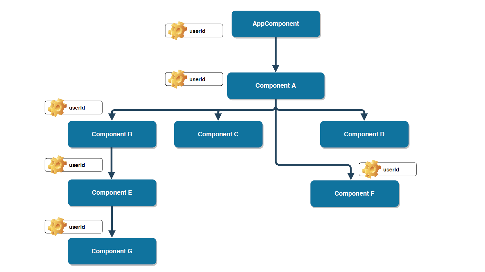

I’ve always been fascinated with the idea of mobile application development. Building web apps was one of the reasons I wanted to learn how to code. This fascination has lead me down many paths, from **Java** to **JavaScript** to **Angular** and now to **React**.

When it comes to React development, there are some things that are good to know and some things that we need to know to embark on our great journey. One of the things that is good to know is hooks in React and specifically **useContext()** hook which makes using contexts in react a lot easier.

> Hooks are functions that let you **“hook into”** React state and lifecycle features from function components. Hooks don’t work inside classes — they let you use React state and other features via functions, without classes

Let’s forget the hype around React and focus on what this post should do for you. My primary hope for this article is that it equips you to understand and work with React 
**useContext** hook effectively.

Let's take a closer look at,
  - **What and Why of React's Context API**
  - **Using Contexts before the Introduction of Hooks**
  - **Why using useContext() hook is a cleaner way of using contexts in React than Context APIs**
  - **Wrapping Up**

### What and Why of React's Context API

> Context provides a way to pass data through the component tree without having to pass props down manually at every level.

In any typical react based application, data is passed from parent to child using props

Consider, a react application, which has many nested components. We have at root the AppComponent and nested within the **AppComponent**, at different levels we have several other components.



At the first level, we have **Component A**, which in turn has nested **Components B, C, D and F**. Furthermore, we have Component B which is nested within **Components E 
and G**.

Suppose, we have a requirement to display logged in **User's ID** inside **Component G and F** which is maintained as a property inside AppComponent.

To successfully able to display the **userID** in **Component G and F**, using traditional React approach, we will have to pass the property information all the way down 
the Component tree as a **prop**.

So for **Component G** to display the **userId**, the prop has to be passed through **Component A, B and E**.

As you might have already noticed, even though components A, B, and E has do not need the userId prop, they still have to act as a mediator to pass the prop down to their children.

In typical real-world applications, components may be nested up to **5 or 10 levels** deep. Cluttering those components is definitely not a good web development practice.

So to overcome such cross-cutting concerns so that data can be sent directly to the required component without the hassle of sending it through the tree, the team at react has release a new set of APIs called **Context API** in **React v16.3.0**.

### Using Contexts Before the Introduction of Hooks

To use context before the release of hooks, we usually implemented it by following these 3 steps:

1. We will create a Context, using React's **createContext()** method.
2. We will use the **Provider** in the high-level component to provide the Context Value.
3. We will then Consume the Context value using **render props pattern**.

#### app.js

```javascript

import React from 'react'
import './App.css'
import ComponentA from './components/ComponentA'

export const UserContext = React.createContext()
export const StatusContext = React.createContext()

function App() {
    return (
        <div className="App">
            <UserContext.Provider value={'Vaibhav'}>
                <StatusContext.Provider value={'Focusing'}>
                    <ComponentA />
                </StatusContext.Provider>
            </UserContext.Provider>
        </div>
    )
}

export default App

```

#### ComponentA.js

```javascript

import React from 'react'
import ComponentF from './ComponentF'

function ComponentA() {
    return <ComponentF />
}

export default ComponentA


```

#### ComponentF.js

```javascript

import React from 'react'
import { UserContext, StatusContext } from '../App'

function ComponentF() {
    return (
        <div>
            <UserContext.Consumer>
                { userId => {
                    return (
                        <StatusContext.Consumer>
                            { status => {return <div>User context value {userId}, Status context value {status}</div>}
                            }
                        </StatusContext.Consumer>
                    )
                  }
                }
            </UserContext.Consumer>
        </div>
    )
}

export default ComponentF

```

### Using Contexts After the Introduction of Hooks. It's a cleaner way of using contexts in React than Context APIs

Now, as you have seen using Context API, makes the creation of context quite easier. However, we still needs to use **Context.Consumer** to consume the context value.

As you might think, having multiple contexts, going to difficult consuming those values.

In such scenarios, React's **useContext()** hook comes handy as it makes consumption of **Context values** a lot easier and clean.

There are 3 simple steps to consume context using **useContext()** hook:

1. We need to import the useContext from react.
2. Import the required contexts. In our example, **UserContext and StatusContext**.
3. Finally, we call the **useContext()** function passing UserContext and StatusContext as arguments.

**UserContext** will return the context value that is nothing but userId. Whereas **StatusContext** will return the status of the user. So once fetched those values, we can straight away use it to display on the UI.

#### ComponentG.js

```javascript

import React, { useContext } from 'react'
import { UserContext, StatusContext } from '../App'

function ComponentG() {

  const userId = useContext(UserContext)
  const status = useContext(StatusContext)
  return <div> User is {userId} and Status is {status}</div>
}

export default ComponentG

```

### Wrapping Up

  - You have learned what a React context API is and with React, now you don't have to differentiate between "is it a class?" 
    or "should I use a functional component?" Also, Hooks let us organize the logic inside a component into reusable isolated units.
  - Unlike patterns such as render props and higher-order components, Hooks don’t introduce unnecessary nesting into your component tree. They also don’t suffer from the drawbacks of mixins.
  - You have also learned that using context hooks, makes consumption of the context much easier and giving you a lot of cleaner code. You'll end up using React's hook every single day of your React development, a great addition to the library.

Hope you find this article useful. Please share your thoughts in the comment section.

I’d be happy to talk! If you liked this post, please share, comment and give a few ❤️ 😊 Cheers. See you next time.