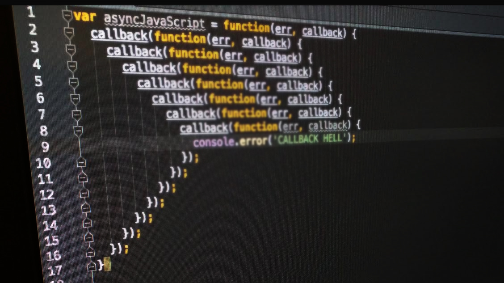

The goal of this article is to define and explore the callbacks as an asynchronous programming construct. As we all know, JavaScript is a popular language for developing web applications and is increasingly used for both client-side and server-side application logic.

> The JavaScript runtime is inherently event-driven and callbacks are a key language feature. Since JavaScript is single-threaded, any long-running operations are blocking. JavaScript uses events to handle these blocking operations.

Lets take a closer look at,
  - **What are Callbacks in Javascript?**
  - **Building Callbacks**
  - **Issues with Callbacks**
  - **Fixing Callback Hell**
  - **Parting Thoughts**

## What are Callbacks in Javascript?

> Callbacks are the most basic form of JavaScript Asynchronous Programming. In simple words, a callback is a function that gets invoked after another function completes.

In JavaScript, functions are treated as objects which allow them to be passed around as arguments, returned by functions and stored into variables. A callback is a function object which can be passed as an argument into a **Higher Order Function**. HOF are functions that accept functions as arguments and can return a function as a result.

Any function that does not return instantaneously should be asynchronous. The traditional approach to designing asynchronous functions relied heavily on callbacks.

Programming with callbacks is especially useful when a caller does not want to wait until the callee completes. To this end, the desired non-blocking operation is scheduled as a callback and the main thread continues its synchronous execution.

Let’s take a look at a small example and discuss how to build callbacks.

## Building Callbacks

The first thing we need to know that, Callbacks in JavaScript follow an unofficial convention. A callback may take in as many arguments as needed or specified by the Higher-Order Function, but the first argument should be the error object. Again this no hard and fast rule, this is just a convention followed by nearly every API in existence.

##### understand-callbacks.js

```javascript

let https = require('https');

let make_request = function(url, callback) {

  var options = {
    host: this.host,
    path: url,
    method: 'post'
  };

  var req = https.request(options, function(res) {
      
    var buffer = '';
    
    res.on('data', function(data) {
      buffer += data;
    });
    
    res.on('end', function() {
      if (res.statusCode !== 200) {
        var message;

        try {
          message = JSON.parse(buffer);
        } catch(e) {
          message = buffer;
        }

        return callback('Error : ' + res.statusCode); // callback is invoked with error.
      }
      
      try {
        var json = JSON.parse(buffer);
      } catch (err) {
        return callback(err);  // callback is invoked with error.
      }
      
      callback(null, json); // callback is invoked with no error.
      
    });
    
  });

  req.on('error', function(err) {
    callback(err);  // callback is invoked with error.
  });

  req.end(data);
}

let callback = function (error, data) {
    
    if(error){
        console.log('Error Occured');
    }
    
    if(data){
        console.log('Request Successful');
    }
}

make_request('https://www.example.net/api/v1/sample/', callback);

```

1. As you can see when we have written a function called **request** that takes two arguments: URL, callback.
1. We then make an HTTP request to provided **URL** using **post** method.
1. Once the request is successful, we invoke the callback provided with null as the first argument (as there is no error) and data received is passed as the second argument.
1. However, that's not the case all the time, in real life response from API may throw an error. To handle this we are invoking the callback with an error as a first argument.

Let's see what can go wrong when using callbacks.

## Issues with Callbacks

Callbacks are easy to use and serve their purpose well, but there are a few issues to consider when using callbacks. The two most common issues are **Callback Hell** and **Callback Existence Assumption**.

#### Callback Hell

Developers often need to combine several callback-accepting functions together to achieve a certain task. For example, two callbacks have to be nested if the result of
the first callback needs to be passed into the second callback in a non-blocking way. This structure becomes more complex when the callbacks need to be conditionally nested.

```javascript

    getData(function(a) {
      getMoreData(a, function(b) {
        getMoreData(b, function(c) {
          getMoreData(c, function(d) {
            getMoreData(d, function(e) {
              // ...
            })
          })
        })
      })
    })

```

#### Callback Existence Assumption

It is always wise to check that the callback function passed in the parameter is indeed a function before calling it. Without the check in place, if the **callback** function is called either without the actual function as a parameter or in place of a function a non-function is passed, our code will result in a runtime error.

```javascript

function make_request (url, data, callback) {
  // what happens if callback passed as an argument is not a function.
}

```

To summarize, callback problems comes from the fact that callbacks:

1. Don’t compose easily for multiple levels of callbacks.
1. This leads to code that is not extensible.
1. Inconsistency between the order of parameters.
1. Lacks, inbuilt error handling.


## Fixing Problems Associated with "using Callbacks"

Callback hell can be easily avoided with two tricky ways: **Named Functions** and **Modules**.

#### Fixing Callback Hell using Named Functions

A name function is nothing but a function defined and assigned to a variable. So using named function instead of nested callbacks prevents our code from cluttering. Named callbacks can be reused and are easily identified in stack traces or breakpoints during debugging activities.

In Our initial example, we are already having a callback defined as named function to make it easily readable.

```javascript

let callback = function (error, data) {
    // same as previously defined.
}

function make_request (url, data, callback) {
    // callback here is a named function passed as an argument
}

```

Separate your code into modules, so you can export a section of code that does a particular job. Then you can import that module into your larger application.

#### Fixing Callback Existence Assumption

To overcome this problem, considering back the same example, We first check that callback provided is not null and it is a valid function using **typeof** operator.

##### understand-callbacks.js

```javascript

function make_request (url, data, callback) {

  if(!callback || !( typeof callback === 'function' )){
    throw new Error('Provided Callback is not a function. Please provide a function.');
  }
  
  // remaining part is same as above.
}
```

To summarize, problems with callbacks can substantially be reduced if We:

1. Don't nest functions. Give them names and place them at the top level of your program
1. Handle every single error in every one of your callbacks.
1. Create reusable functions and place them in a module to reduce the cognitive load required to understand your code. Splitting your code into small pieces like this also helps you handle errors, write tests, forces you to create a stable and documented public API for your code, and helps with refactoring.

And of course, you can always choose to ignore all of this callback stuff and go fall in love with promises. **Promises are a JavaScript language extension. A Promise based function takes some input and returns a promise object representing the result of an asynchronous operation**. But that deserves it's whole other post entirely :)

## Parting Thoughts

  - You have learned what a Callback is and why Callback is the most basic form of Asynchronous Programming in JavaScript. Unfortunately, callbacks induce a non-linear control flow and can be deferred to execute asynchronously, declared anonymously, and may be nested to arbitrary levels.
  
  - We have seen an example that takes a callback as an input argument which is invoked depending upon the state of execution of the HOF.

  - You have also learned how to avoid callback issues by gracefully defining named functions. However naming causes the callback function to persist in memory and prevents it from being garbage collected. On the other hand, anonymous callbacks are more resource-friendly because they are marked for garbage collection immediately after being executed. However, anonymous callbacks are not reusable and may be difficult to maintain, test, or debug and checking for the existence of the callback function.
  
  - You'll end up seeing Callbacks in a lot of legacy libraries. So It's absolutely important to understand how callback works. 

Hope you find this article useful. Please share your thoughts in the comment section.

I’d be happy to talk! If you liked this post, please share, comment. See you next time.

