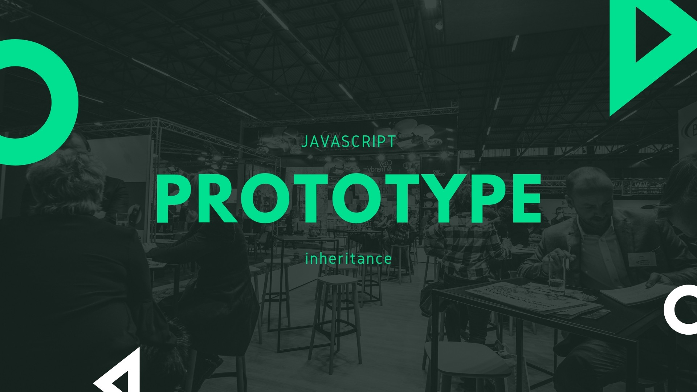
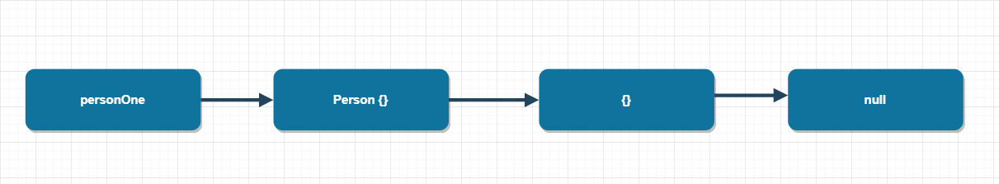

When it comes to JavaScript development, there are some things that are good to know and some things that we need to know to embark on our great journey.
One of the things that you should know is a prototypal inheritance.

The goal of this article is to define and clarify the different aspects of **“Prototypes in JavaScript”**.

Lets take a closer look at,
  - **What are Javascript Objects**
  - **What's a prototype? and how to create one?**
  - **How does it work?**
  - **Gets are deep, but sets are always shallow**
  - **Difference between  prototype, getPrototypeOf and \__proto\__**
  - **Parting Thoughts**

### What are Javascript Objects

> Objects are JavaScript's fundamental data structure. Like many other languages, JavaScript provides support for implementation inheritance: the reuse of code or data structure through a **dynamic delegation mechanism**.

However, unlike many other conventional languages, JavaScript's inheritance mechanism is based on prototypes rather than classes.

In many languages, for example, Java every object is nothing but an instance of pariticular class, which provides code shared between all of its instances and inheritance provided by such languages is very static, you cannot do something that you can with aggregates.

On the other hand, JavaScript has no built-in notion of classes. Instead objects inherit from other objects. So it allows every object to be assosicated with some other object, known as its **__prototype__**.

### What's a prototype? and how to create one?

To understand, what and why of prototype let's look at following example,

1. We have a person object, with **firstName** and **lastName** properties.
1. As you can see when we invoke a function called work on person object, javascript throws an error as there is no such property exists.
1. We will then attach an employment object containing work function to person's prototype using syntax **__proto__**.
1. Now, if we invoke function work on person object, **'Working ...'** is displayed in console.


```javascript

var person = {
	
	firstName: 'John',
	lastName: 'Smith'
};

console.log(person.firstName); // outputs John

person.work() // throws error, as there is no such function property exists in person object


var employment = {
	work : function () {console.log('Working ...');}
};


console.log(person.__proto__); // outputs {}, as there is no prototype object is assosicated with person

person.__proto__ = employment;

person.work(); // outputs Working ...

```

### How does it work?

As inheritance in JavaScript is implemented using an object chain, and not using a class hierarchy, to understand prototypal inheritance we have to know how object chaining behaves.
Lets take a look at an example.

###### understand-prototype.js

```javascript

class Person {}

const personOne = new Person();
const personTwo = new Person();

const personOnePrototype = Reflect.getPrototypeOf(personOne);
const personTwoPrototype = Reflect.getPrototypeOf(personTwo);

console.log(personOne === personTwo); //outputs false
console.log(personOnePrototype === personTwoPrototype); //outputs true

```

1. As you can see when we created two objects of class Person and compared their identity and the identity of their prototypes.
1. The objects are different, but they share their prototypes.
1. The instance **personOne** of Person has a prototype **Person {}**, which in turn has a **prototype {}**, which has null as its prototype, resulting in end of the prototype chain.



> Two objects of the same class in class-based inheritance share the same class hierarchy, two objects of the same class in **prototypal inheritance share the same object chain**.

### Gets are Deep, but Sets are Shallow

The motivation behind the inheritance is to reuse the methods and properties. In class-based inheritance, the instances of a class reuse the members of the class’s
base class. Whereas, in the case of prototypal inheritance, the prototype is reused by delegating calls to its prototype.

However, the behavior is widely different when we are trying to get a property as compared to setting it. 

So let’s dig in,

```javascript

class Person {}

Person.prototype.birthYear = 2000;
Person.prototype.calculateAge = function () { return new Date().getFullYear() - this.birthYear; };
Person.prototype.incrementBirthYearByOne = function () { this.birthYear += 1; };

const person1 = new Person();
const person2 = new Person();

console.log(person1.calculateAge()); //outputs 19
console.log(person2.calculateAge()); //outputs 19

person1.incrementBirthYearByOne();

console.log(person1.calculateAge()); //outputs 18
console.log(person2.calculateAge()); //outputs 19

```
1. We added and initialized a field, **birthYear**, to the prototype
1. Then we added a function, **calculateAge()**, to the prototype as well.
1. When called, will return the difference between the current year and ```javascript this.birthYear```. 
1. We then created two instances of Person — **person1** and **person2** — and displayed the value returned by **calculateAge()**.
1. The birthYear field does not exist directly in these instances, but JavaScript will get the values from the prototype.
1. We then called the **incrementBirthYearByOne()** function on person1. Once again, **incrementBirthYearByOne()** is reused from the prototype and it increments ```javascript this.birthYear``` by 1.
1. We then asked for the age on the two instances by invoking function **calculateAge()**, and we get the output that confirms the isolation of the instances.


One thing to note here is that even if we override the field or property in the derived class, then we will correctly use the overridden field or property in the instance and not the one in the base class.

### Difference between  prototype, getPrototypeOf and \__proto\__

  - Person.prototype is used to establish the prototype of objects created by new operator i.e new Person().
  - Object.getPrototypeOf(person1) is used for retrieving person1's prototype object.
  - person.__proto__ is non-standard mechanism for retrieving person1's prototype object.
  
```javascript

  Object.getPrototypeOf(person1) === Person.prototype; // outputs true
  person1.__proto__ === Person.prototype; // outputs true

```
### Parting Thoughts

  - JavaScript supports object-oriented programming, but unlike most of the other mainstream languages, it offers prototypal inheritance instead of class-based inheritance.
  - You have learned what a Prototype is and with Prototypal Inheritance, now you can achieve dynamic delegation.
  - You have seen that when a field or property is not present in an object, JavaScript will search for it in the prototype chain—that is, it will automatically look it up in the base class.
  - You have also learned the differences between prototype, getPrototypeOf and \__proto\__.
  - You'll end up using JavaScript's prototypal inheritance at many, a great feature of the language.

Hope you find this article useful. Please share your thoughts in the comment section.

I’d be happy to talk! If you liked this post, please share, comment and give a few ❤️. See you next time.