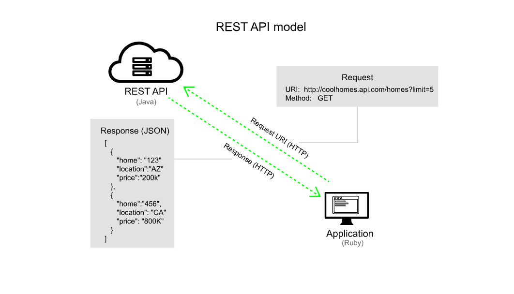
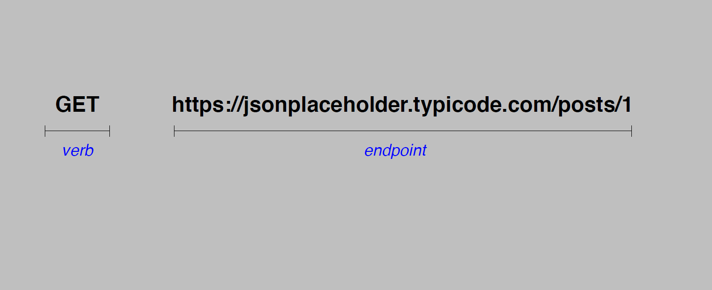
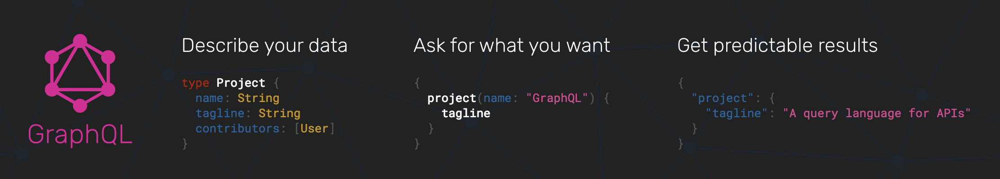
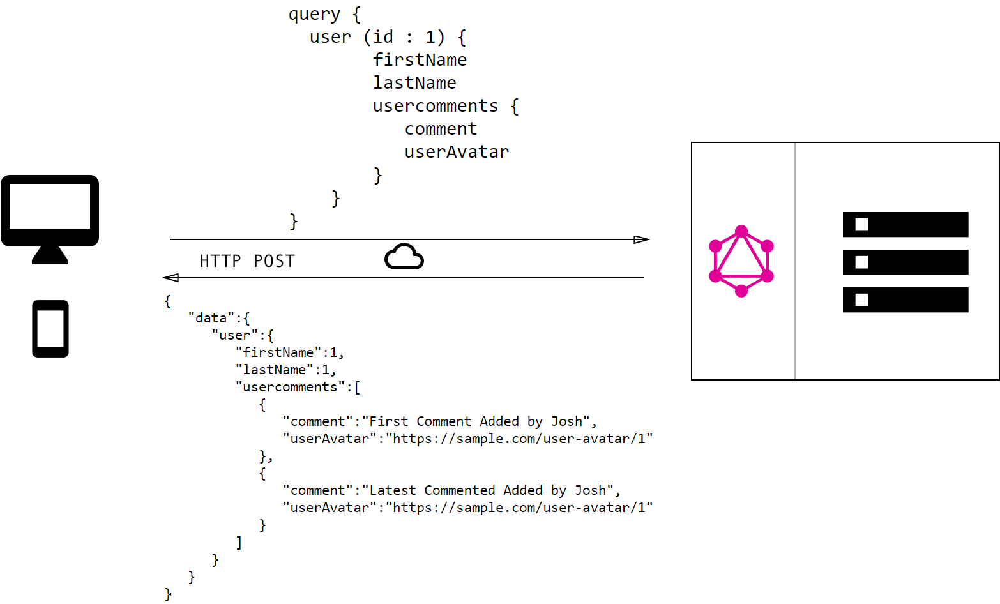

GraphQL is a query language that can be used anywhere, but it often used to fulfill the gap between client and server applications. 

Let's see how we can optimize APIs for consumers with GraphQL but before we dive into GraphQL, let's start with APIs and more specifically REST API's.

Let's take a closer look at,
  - **REST isn't a fit for modern applications**
  - **GraphQL to the rescue**
  - **Who is using GraphQL?**
  - **Key Takeaways**

### What is a REST API?

In general, an API (or Application Programming Interface) provides an interface between two systems. It’s like a cog that allows two systems to interact with each other. In this case, the two systems are computers that interact programmatically through the API.

> In REST, everything evolves around the idea of having resources that are accessible by URLs.

The following diagram shows the general model of a REST API:



So when looking at a REST API specifically a request for a REST API there are a few components to it the first is an HTTP verb or method and that specifies the operation that we'd like to take against the API and the second is an endpoint which is an identifier that allows us to specify the part of the API that we'd like to interact with.



### REST isn't a fit for modern applications

Let's dig into an example to understand this,

If we execute this request we'll get back a response that looks like this in this particular case this API returns back JSON and it's comprised of information about user along with URLs to fetch user comments from the server.

```json

// a RESTful request with HTTP GET

https://api.sample.com/users/

// the response in JSON

[
  {
    "userId": 1,
    "id": 1,
    "firstName": "Josh",
    "lastName": "Long",
    "userComments": "https://sample.com/user-comments/1"
  },
  {
    "userId": 1,
    "id": 2,
    "firstName": "Venkat",
    "lastName": "Subramaniam",
    "userComments": "https://sample.com/user-comments/2"
  }
]

```

So if we look at the response, we can see that, user details such as first name and last name of the user, in some cases you'll also see hypermedia such as **userComments** which is nothing but a machine-readable link to another place in the API about information related to the resource.

Now if we execute that request you'll notice that we get again attributes and more hypermedia.

```json

// a RESTful request with HTTP GET

https://sample.com/user-comments/1

// the response in JSON

{
   "userId":1,
   "id":1,
   "userComments":[
      {  
         "userId":1,
         "id":10,
         "comment":"First Comment Added by Josh",
         "userAvatar":"https://sample.com/user-avatar/1"
      },
      {  
         "userId":1,
         "id":11,
         "comment":"Latest Commented Added by Josh",
         "userAvatar":"https://sample.com/user-avatar/1"
      }
   ]
}

```

If you imagine us as a desktop/web application you will immediately say that it takes numerous requests for us to determine the information that we may need as a client.

We have to keep making HTTP requests to get all the details that we need and this is especially painful when you're working with say a mobile client which might be working off a super slow connection.

This problem is called **over fetching**. The point-to-point nature of REST, a procedural API technology, forces the authors of services and clients to coordinate each use case ahead of time. 

When frontend teams must constantly ask backend teams for new endpoints, often with each new screen in an application, development is dramatically slowed down.

So **REST API's are optimized around servers** and not necessarily clients and they're modeled around the resources that they return which makes them general-purpose and reusable from client to client and honestly that's one of rests biggest strengths.


### GraphQL to the Rescue

> "GraphQL is a query language designed to build client applications by providing an intuitive and flexible syntax and system for describing their data requirements and interactions". - GraphQL Specification



In short, GraphQL is an open-source query language specification created by Facebook, a company that unsurprisingly remains at the pinnacle of web-based software development. 

Facebook used it internally for its mobile applications since 2012, as an alternative to the common REST architecture and it's been implemented in a variety of different languages like Ruby, JavaScript, Python and so on.

It allows requests to be made for specific data, giving clients more control over what information to be retrieved. This is more difficult to achieve with a RESTful architecture because the backend defines what data is available for each resource on each URL, while the frontend always has to request all the information in a resource, even if only a part of it is needed.

Once a GraphQL service is running (typically at a URL on a web service), it can be sent GraphQL queries to validate and execute. A received query is first checked to ensure it only refers to the types and fields defined, then runs the provided functions to produce a result.

For example the query:



One query already requests multiple resources (comments), called fields in GraphQL, and only a particular set of nested fields for these fields (name, urlSlug for article), even though the entity itself offers more data in its GraphQL schema (e.g. description, releaseData for article). 

A RESTful architecture needs at least two round trips to retrieve the user entity and its comments, but the GraphQL query made it happen in one. In addition, the query only selected the necessary fields instead of the whole entity.

That’s GraphQL in a nutshell. The server application offers a GraphQL schema, where it defines all available data with its hierarchy and types, and a client application only queries the required data.


### Who is using GraphQL?

Facebook is the driving company behind the GraphQL specification and reference implementation in JavaScript, but other well-known companies are also using it for their applications. They are invested in the GraphQL ecosystem due to the huge demand for modern applications. 

Apart from Facebook and Instagram, GraphQL has also been used by these well-known companies:
  - GitHub
  - Shopify
  - Twitter
  - Coursera
  - Strip
  - Wordpress
  - The New York Times

### Key Takeaways

  - This tutorial gives you a basic idea of how GraphQL helps us be client-centric than server-centric. 
  It allows us to perform optimized queries to application servers, requesting only data required by the client at that moment in time.

  - You also learned that GraphQL is not a programming language, but is instead a language used to query application servers that have capabilities to provide the results of complex queries.
 
Hope you find this post useful. Please share your thoughts in the comment section.

I’d be happy to talk! If you liked this post, please share, comment.