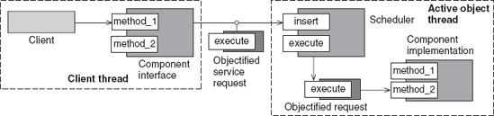
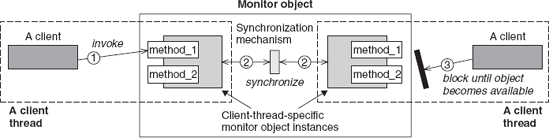

> The choice of concurrency architecture has a significant impact on the design and performance of multi-threaded software in general, and distributed software in particular. No single concurrency architecture is suitable for all workload conditions and platforms. Active Object and Monitor Object are both widely used concurrency design patterns.


They have some similarities, as well as notable differences. This article presents these two patterns side by side in the hope of explaining them clearly.

## ACTIVE OBJECT PATTERN

> The Active Object pattern decouples service requests from service execution to enhance concurrency and simplify synchronized access to objects that reside in their own threads of control. Typically, an active object provides synchronous methods and executes the method calls in an asynchronous way. An active object usually has its own thread of control.

This pattern is useful in refactoring legacy projects by introducing concurrency capability.

The key elements in active object pattern are:

 - Proxy (or Client Interface) - A public method provided by active object to clients.
 - Dispatch Queue - A list of pending requests from clients.
 - Scheduler - Determines the order to execute the requests.
 - Result Handle (or Callback) - This allows the result to be obtained by proxy after a request is executed.



An Active Object design enhances concurrency in an application by allowing clients threads and the execution of service requests to run simultaneously: clients are not blocked while their service requests are executed.


```javascript

import java.util.concurrent.PriorityBlockingQueue;

public class ActiveObjectHandler {

  private PriorityBlockingQueue <Task> dispatchQueue = new PriorityBlockingQueue < > ();

  class Task implements Comparable <Task> {
  
    private int priority;
    private String name;
	
    Task (String name, int priority) {
      this.name = name;
      this.priority = priority;
    }
	
    public int compareTo(Task other) {
      return Integer.compare(this.priority, other.priority);
    }
	
  }
  
  public ActiveObjectHandler () {
  
    // A priority scheduler
	
    new Thread(() - > {
        while (true) {
		
          try {
            
			Task task = dispatchQueue.take();
            System.out.println("Executing task " + task.name);
			
          } catch (InterruptedException e) {
            break;
          }
		  
        }
      }).start();
  }
  
  public void performTask(String name, int priority) {
    dispatchQueue.put(new Task(name, priority));
  }
  
}

```

To test the ActiveObjectHandler, we can simply create several threads calling performTask method at the same time, as shown in the following code.

```javascript

	ActiveObjectHandler activeObjectHandler = new ActiveObjectHandler();

	Thread t1 = new Thread(() - > {
	  activeObjectHandler.performTask("1", 2);
	});
	
	Thread t2 = new Thread(() - > {
	  activeObjectHandler.performTask("2", 0);
	});
	
	Thread t3 = new Thread(() - > {
	  activeObjectHandler.performTask("3", 1);
	});
	
	t1.start();
	t2.start();
	t3.start();

```

## MONITOR OBJECT PATTERN

> Concurrent software often contains objects whose methods are invoked by multiple client threads. To protect the internal state of shared objects, it is necessary to synchronize and schedule client access to them. Generally, Monitor Object is a pattern that controls the concurrent access of a method in an object. If there are some concurrent threads calling a method at the same time, only one thread can execute this method.

Here are some important concepts in Monitor Object pattern:

 - Scoped lock - Scoped lock is used to protect a critical section.
 - Condition variables - A condition variable is used to suspend a thread. Once a condition is satisfied, threads waiting on this condition are awoken.

 
 
Each monitor object contains a monitor lock that it uses to serialize access to the object's state. Within a synchronized method, first acquire the monitor lock to ensure no other synchronized methods can execute. Java has built-in support of concurrency. Every object in Java has an intrinsic lock, with synchronized keyword we can easily protect a critical section. We can also implement condition variables using wait/notify methods. 

The following code is an example of Monitor Object.


```javascript

import java.util.LinkedList;

public class MonitorQueue {

  private LinkedList <Integer> queue = new LinkedList <> ();

  public synchronized void append(int number) throws InterruptedException {
    queue.addLast(number);
    notifyAll();
  }

  public synchronized int poll() throws InterruptedException {
  
    while (queue.size() == 0) {
      wait();
    }
	
    return queue.removeFirst();
  }
}

```

Hope you find this article useful. Please share your thoughts in the comment section.
I’d be happy to talk! If you liked this post, please share, cheers. See you next time.

##### References
  [1] Pattern-Oriented Software Architecture: A Pattern Language for Distributed Computing, 4th Volume
  [2] https://repozytorium.ukw.edu.pl/bitstream/handle/item/3523/Active%20object%20design%20pattern.pdf?sequence=1&isAllowed=y