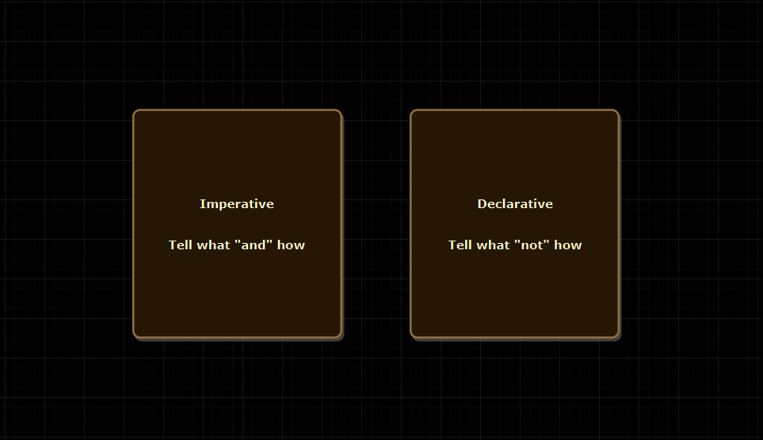

A lot of people complain that **OOP** has done very poorly. Well sure but a lot of things have been done poorly but our enemy is not **Object Oriented Programming**.

The real conversation is not the difference between object-oriented and functional, the difference is **Imperative versus Declarative** style of programming.

Well as a mainstream programmer, we've been programming an imperative style for a very long time and of course, the world is moving towards more of a declarative style of programming.

So the real question is to program imperatively or should we program declaratively and which one should we choose?

Let's explore,
  - How they are different.
  - Code example.
  - Parting Thoughts.
  
### What is the difference though between these two paradigms?

> Imperative style of programming is where you tell what to do but you also have to spend the time and effort telling how to do it. So not just the **what** but also the **how**. **First do this and next do that**.



### Let's look at an example
So here I have a little program. I have a list of names but I want to know if our good friend Nemo is on the list.

So how do I find if Nemo is on this list?

  - The very first step I'm gonna do, is I'm gonna define a boolean found is equal to false and of course if we found what do I want to output Nemo found.
  - Otherwise, what  I'm gonna say Nemo not found. 

```java

    List<String> names = List.of("Gill", "Dorry", "Bruce", "Nemo", "Darla");

    boolean found = false;
    
    for (String name : names) {
        if (name.equals("Nemo")) {
            found = true;
            break;
        }
    }
    
    if (found) {
        System.out.println("Nemo Found. :-)");
    } else {
        System.out.println("Nemo Not Found. :-(");
    }
    
``` 
When I run the code it says **"Nemo Found. :-)"**.

This is an example of an imperative style of code as we are not only explicit about what to do but also how to do it.

Now let's take a look at code, that is an example of a declarative style of programming. 

>  Declarative style is where we tell **what** to do and **not how** to do it. It is an **abstraction** on top of imperative systems that opens the whole new world of possibilities to program in **asynchronous** and **event-driven** fashion without having to think about how to it works.


```java
List<String> names = List.of("Gill", "Dorry", "Bruce", "Nemo", "Darla");

    if (names.contains("Nemo")) {
        System.out.println("Nemo Found. :-)");
    } else {
        System.out.println("Nemo Not Found. :-(");
    }
``` 

### Parting Thoughts

  - The fact that everything ends up being imperative at some point as it hits the operating system and hardware is important to remember and understand because it helps us with the mental model of what declarative programming is addressing and how it ultimately executes - there is no magic.

  - Imperative Style is easy to write but it's hard to read.
  
  - On the other hand, Declarative Style is easy to read but it's hard to write (to a certain extent due to unfamiliarity).
  
  - Should programs be imperative or should they be functional? and I'm gonna say the answer to me is that it's neither one of them and there are times when the code has to be imperative and there are times when the code has to be functional and I think it is very naive to say it's got to be entirely one and not the other.
 
 
Hope you find this post useful. Please share your thoughts in the comment section.

I’d be happy to talk! If you liked this post, please share, comment and give a few 👏 😊 Cheers