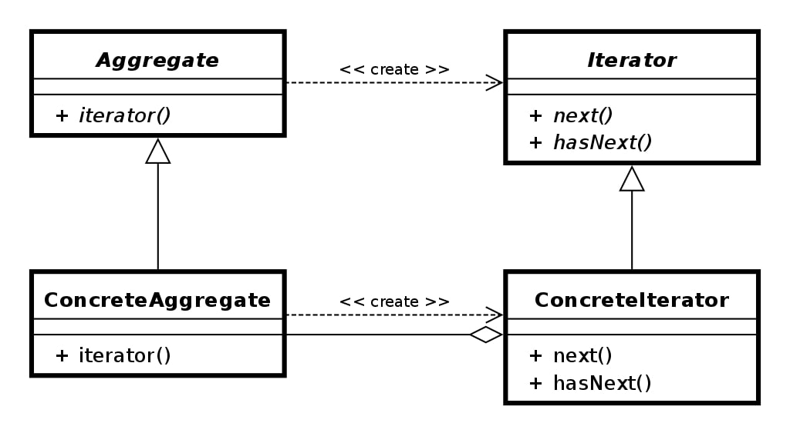
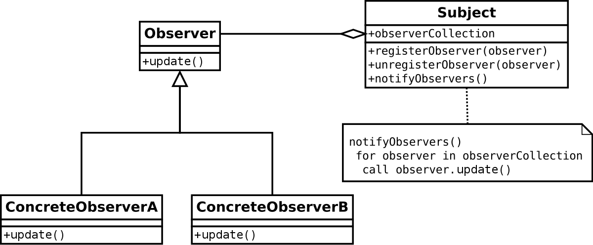
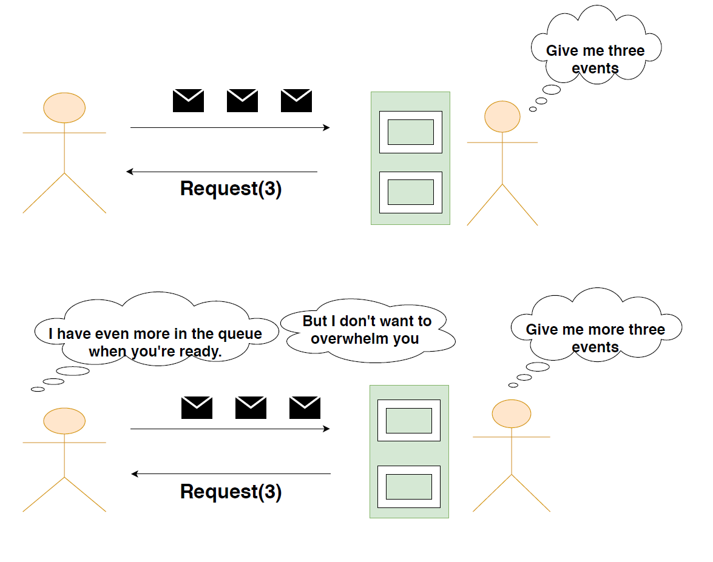

Before we start on the Reactive Programming Paradigm let's have a brief introduction to programming paradigms in general. 

> The word “paradigm” comes from the Greek word “paradeigma,” and generally refers to a category of entities sharing a common characteristic. By implication, a programming paradigm is a fundamentally common style of computing.

It may be helpful to understand the history of programming languages before discussing current programming paradigms. In the 1940s, programs, including all instructions and memory locations, were written in machine-level programming languages in binary form, and memory had to be manually moved around. 

Programming in binary code was tedious and error prone, and the programs were not easy for humans to read, write, or debug. In addition, a simple algorithm resulted in a lengthy code, proving the need for a mnemonic code to represent operations.

To mitigate the difficulty of writing in binary, symbolic programming languages like assembly language were introduced In the 1950s that used symbolic notation to represent machine language commands. As a result, programmers could assign meaningful names to computer instructions. 

Furthermore, even additional high level programming languages were introduced, making programming even easier. So that's how the journey of various programming paradigms began.

Let's get back to the crucial part of this article and dig in different aspects of “Reactive Programming Paradigm”.

> Reactive Programming is a subset of **Asynchronous Programming** where the availability of new event drives the computation forward rather than having control flow driven by a thread-of-execution. The term, **“reactive,”** is a general programming term that is focused on reacting to changes such as network components reacting to **I/O events**, UI controllers reacting to **mouse events, and others**.

In short, **non-blocking** is reactive, because, instead of being blocked, we are now in the mode of reacting to notifications as operations complete or data becomes available.

Lets explore,
  - **A Brief History about Design Pattern in General**
  - **A Quick Look at Iterator Pattern**
  - **A Quick Look at Observer Pattern**
  - **Reactive Supports Back-pressure**
  - **Areas where Reactive Programming Shines**
  - **Wrapping Up**
  
### A Brief History about Design Pattern in General

Around 20 years ago the folks who wrote the a design patterns book the Gang of Four, defined all these different design patterns that were being used by developers and one of those design patterns was the **Iterator pattern** another design pattern that they codified was the **observer pattern**.

Lot of Java developers are familiar with the iterable datatype so it's a contract that any collection can implement and that basically allows you a consistent way of being able to consume all the data in that collection progressively one item at a time.

So let's say you are the producer and I'm a consumer and I want to get the data out of you, well if you're an iterable what I do is I ask you for an iterator and then I pull each value out of that iterator.

As I said progressively pulling one value at a time out of you now at some point you can have two options you can tell me no more data furthermore you can also throw and that's a way of telling me that an error happened.

In short, the **observer pattern** was about a way for a producer to give a consumer data one item at a time but the difference here is that with the **iterator pattern**, 
is I as a consumer I am in total control and I decide when to pull data out but in the observer pattern it's the producer that's in control and it decides when the consumer 
is going to receive data.

#### A Quick Look at Iterator Pattern

> Iterator pattern lets us abstract how we iterate over a specific collection by wrapping this iteration inside an object and providing a uniform API.

Any collection at the minimum needs to provide clients APIs to add and remove elements from it. But more importantly, it needs to allow clients to traverse through the elements it stores.

#### A Quick Look at Observer Pattern

> The Observer pattern lets a number of observers get notified when something changes in a subject that they are observing.

The observer pattern was pretty good for things like UI events and the Iterator pattern was really good for traversing all types of different collections in a consistent way. But one thing they missed was the correspondence between these two patterns.

There are two things actually missing from the observer pattern :

1. With the iterator pattern we have the semantics that allows us to pull data out but we also have these two semantics of the producer telling the consumer  no more data and also the producer telling the consumer an error occurred.

1. Oddly the Gang of Four left those two semantics out of the observer pattern so what if when you registered for an event you could register three callbacks instead of one and in addition to the producer sending you data the producer could also tell you an error occurred asynchronously by invoking a callback. Furthermore the producer could tell you that no more data was ever coming by invoking a completion callback.

Reactive extension is basically about unifying the observable pipe with the iterable pipe and it introduces this new type called an observable.

> **Observable pipe + Iterable pipe = Observable**

### Reactive Supports Back-pressure

In Reactive Programming, it is not difficult to get into a situation in which an Observable is emitting items more rapidly than an operator or subscriber can consume them. This presents the problem of what to do with such a growing backlog of unconsumed items.

When one component is struggling to keep-up, the system as a whole needs to respond in a sensible way. It is unacceptable for the component under stress to fail catastrophically or to drop messages in an uncontrolled fashion.

Since it can’t cope and it can’t fail it should communicate the fact that it is under stress to upstream components and so get them to reduce the load. This back-pressure is an important feedback mechanism that allows systems to gracefully respond to load rather than collapse under it.

Backpressure doesn’t make the problem of an overproducing Observable or an underconsuming Subscriber go away. It just moves the problem up the chain of operators 
to a point where it can be handled better.

### Areas where Reactive Programming Shines

  - **The Internet of Things (IoT)**: with its explosion of connected sensors, gadgets and appliances - creates challenges in how to deal with all of these simultaneously data generating devices that produce lots of information that has to be retrieved, aggregated, analyzed and pushed back out the the devices, all while maintaining overall system responsiveness. 

  - **Microservices-based Architecture**: benefits a lot from the value delivered by embracing Reactive. Reactive Programming is used within a single Microservice to implement the service-internal logic and dataflow management. Reactive microservices are autonomous. They can adapt to the availability or unavailability of the services surrounding them. 
 
### Wrapping Up

  - Traditional async patterns like callbacks don’t scale well and they are not easily composable. Reactive extensions give us the ability to handle events and react to data using some higher level abstractions. Reactive programming leads you to write readable declarative code.
  - It might not be the type of library you rely on to solve one problem in the application. Reactive Programming is of particular importance for object-oriented Java where asynchronicity often results in the code that is hard to understand and maintain.
  - Generally, while working with complex tasks and HTTP calls, handling errors is a major task, especially in the absence of any standard mechanism, it becomes a headache. In such cases, Reactive Programming provides standard mechanism for error handling.
  - Reactive Programming offers productivity for Developers—through performance and resource efficiency—at the component level for internal logic and data transformation. We can get the best of both the worlds by combining the techniques of Reactive Programming within the design principles of Reactive Systems.

I’d be happy to talk! If you liked this post, please share, comment and give a few ❤️ 😊 Cheers. See you next time.
