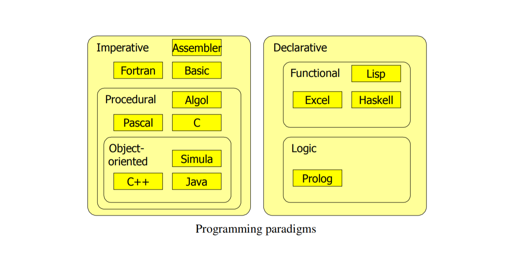
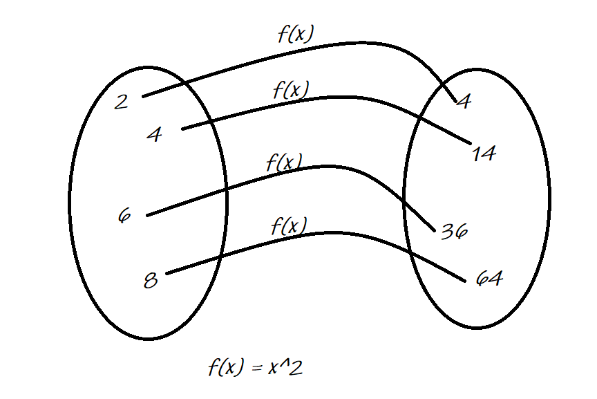
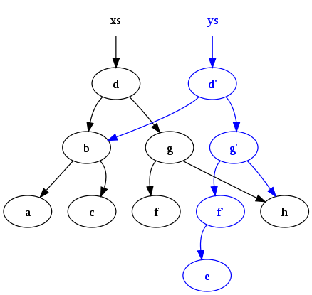

The goal of this article is to define and clarify the different aspects of “Functional Programming”. Before we start on the functional programming paradigm we give a brief introduction to programming paradigms in general. 

Lets explore,
  - **Functional Programming Paradigm vs Other Paradigms**
  - **Say No to Side Effects !!**
  - **Immutability to the Rescue?**
  - **Led to the Persistent Data Structures**
  - **Pure Functions, Higher Order Functions**
  - **Transitioning from Imperative to Functional**
  - **Parting Thoughts**

## Functional Programming Paradigms vs Other Paradigms



> Imperative style of programming is where you tell what to do but you also have to spend the time and effort telling how to do it. So not just the **what** but also the **how**.

> In object-oriented, everything is represented as an object. Objects are collections of operations that share a state. The operations determine the messages (calls) to which the object can respond, while the shared state is hidden from the outside
world and is accessible only to the object's operations.

> In general terms, **“Functional,”** programming is a way of writing software applications using only pure functions and immutable values.

Functional programming is in many respects a simpler and more clean programming paradigm than the imperative one. The reason is that the paradigm originates from a purely mathematical **discipline: the theory of functions**.



## Say No to Side Effects !!

Let's say we start with the three element array X and we call some function on X which performs some computation, so we produce some output Y.

Now the question is what's X at the end of this?

```javascript

x = [1, 2, 3]

y = f(x)

x = ?
```

It's the same. That's the rule.

```javascript

x = [1, 2, 3]

y = f(x) + g(x) + a(f(g(x)) + b(g(f(x)))) + h(f(g(x)) + b(g(f(x)))) 
	- g(a(f(g(x)) + b(g(f(x)))) - a(f(g(x)) + b(g(f(x)))))

x = ?
```

Now what's X at the end of this? **Its still the same.**

You can see how this rule actually help you make sense of your programs right. 

I had this thing I call a bunch of functions I still have the same thing. I don't have to look through 25 pages of code trying to figure out if someone is mutating the thing in between.

A function has a side effect if it does something other than simply return a result, for example:
  - **Setting a field on an object**
  - **Modifying a data structure in place**
  - **Modifying a variable**
  - **Printing to the console or reading user input**
  - **Reading from or writing to a file**
  - **Throwing an exception or halting with an error**
  - **Drawing on the screen**
  - **Updating the database**
	

Well, you might think, I am getting paid to do all those things and that's what my customer wants. How can I achieve the expected behavior, without ever modifying the data structure.

## Immutability to the Rescue ?

You don't modify the data, If you cannot mutate anything the answer is really quite simple we provide all of our data structures with an operation which says give me a copy of yourself that's just like you except a little difference. So give me a copy of yourself Mr. ABC array that's exactly like you but the middle middle element is Q.

If it's a hash or a map give me a copy of yourself that has all the keys associated with the same values except for this one which is different or this new one or delete one.

Okay so now we no longer have to worry about anybody changing our data from underneath us but now we have another problem and that other problem is copies right.

If I have a million element array and I want to change three elements in the middle do I change the first one and make a copy of a million elements and then change the second one and make another copy. It turns out that, some very clever people came with an idea of **Persistent data structures**.

## Led to the Persistent Data Structures

> The word persistent doesn't mean save to the database or saved in a file. A persistent data structure is one in which no operations result in **permanent changes** to the underlying structure.




They have two key characteristics,
1. They're immutable and 
1. They support the copy on modification operation and they do it very efficiently without a lot of copying.

## Pure Functions, Higher Order Functions

A **Pure Function** can be defined as following,

> The output of a pure function depends only on its **Input Parameters** and its **Internal Algorithm**. This is different from an OOP method, which can depend on other fields in the same class as the method.

> A pure function has no side effects, meaning that it does not read anything from the outside world or write anything to the outside world.

If a pure function is called with an input parameter x an infinite number of times, it will always return the same result y. For example, any time a **“string length”** function is called with the string **“Elon”**, the result will always be **4**.

In fact, because the **Java String class** is immutable, all of it methods act just like pure functions.

The term **Higher-Order Function (HOF)**, it basically means that,

1. You can treat a function as a value just like you can treat a String as a value and 
1. You can pass that value into other functions.


## Transitioning from Imperative to Functional

When I first started learning FP, I came across an article titled [A Practical Introduction to Functional link](Programminghttps://maryrosecook.com/blog/post/a-practical-introduction-to-functional-programming) by Mary Rose Cook.

She refers to using only pure functions as a Guide Rope to learning FP:

  - “When people talk about functional programming, they mention a dizzying number of ‘functional’ characteristics. They mention immutable data, first class functions, and tail call optimization. These are **language features** that aid functional programming.”

  - “They mention mapping, reducing, pipelining, recursion, currying and the use of higher order functions. These are programming techniques used to write functional code.” “They mention parallelization, lazy evaluation, and determinism. These are **advantageous properties** of functional programs.”

  - “Ignore all that. Functional code is characterized by one thing: **the absence of side effects**. It (a pure function) doesn’t rely on data outside the current function, and it doesn’t change data that exists outside the current function. Every other ‘functional’ thing can be derived from this property.  Use it as a guide rope as you learn.”

1. Make use of *Higher Order Functions*
1. Convert existing methods into *Pure Functions*.
1. Convert loops over to recursive/tail-recursive methods (if possible).
1. Convert mutable data structures into immutable ones.
1. Use Pattern matching technique (if possible).

## Parting Thoughts

Merits of the Functional Programming:

  - Functional programs are deterministic making them easier to reason about. One specific input will always result in the same output.
  - Functional programs are easier to test. As there are no side effects, you don't need to mock, no exceptions to catch, no context mutation to deal with, no shared mutable state, and no concurrent modifications.
  - As Programs are written at a higher level, and are therefore easier to comprehend.
  - As mutation is not permitted, Parallel/concurrent programming becomes easier.


Demerits of the Functional Programming:

  - Combining pure functions into a complete application is where things get hard.
  - Relying solely on immutable values and recursion can potentially lead to performance problems, including Memory usage and speed.

##### Before you go

Hope you find this post useful. Please share your thoughts in the comment section.

I’d be happy to talk! If you liked this post, please share, comment and give few 👏 😊 Cheers


##### References
  [1] http://www.cs.uu.nl/docs/vakken/imp/diktaat/imp-en1.pdf
  [2] http://people.cs.aau.dk/~normark/prog3-03/pdf/paradigms.pdf
  [3] http://alvinalexander.com/downloads/learning-fp-in-scala-0.1.1.pdf